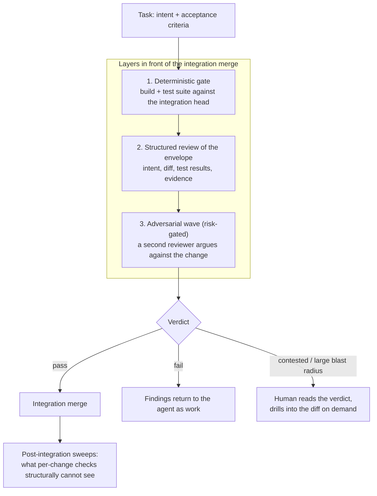

# Skip the Pull Request

*Draft — thesis piece for the pattern P-56 "Skip the Pull Request". Status: unpublished.*

The pull request is not a quality control. It is a queue. In a team of humans that
distinction rarely mattered, because the queue was short and the reviewer was the
only check available anyway. In an agent-first pipeline it matters immediately: the
queue is the single slowest element in a system that can otherwise produce a dozen
verified changes an hour. Everything else in the pipeline scales with compute. The
diff-reading human does not.

The usual response is to make review faster — smaller changes, better summaries, an
AI reviewer that posts comments into the pull request. That keeps the queue and
optimises its throughput. The alternative is to move the accept-or-reject decision
out of the pull request entirely and put it in front of the integration merge, where
the checks that actually discriminate already live.

## What the pull request was actually doing

Three jobs, usually conflated:

1. **Defect detection.** The weakest of the three. Google's study of nine million
   reviewed changes describes review at scale as fast, lightweight and typically
   single-reviewer; its measured value sits mostly elsewhere. DORA's change-approval
   research is blunter: there is no evidence that a more formal external review
   process lowers change failure rates, and heavyweight approval enlarges batches,
   which raises risk.
2. **The audit record.** Who changed what, why, on whose authority. This one is real
   and non-negotiable in most organisations.
3. **Socialisation.** Knowledge transfer, ownership, norm-keeping. Also real — and
   the part people forget when they cheer for deleting the review step.

Only the first job is replaceable by machines. The other two have to be re-homed
deliberately, or removing the pull request quietly costs you something you were not
tracking.

## Where the quality actually goes

Layer one is deterministic and unarguable: the branch builds and the suite passes
against the *current* integration head, not against the head it was cut from. A red
gate blocks the merge, and no amount of eloquent agent summary changes that.

Layer two is where the agent's advantage over the human reviewer appears. A human in
a pull request gets a diff and a title. A review agent gets an envelope: the task
intent, the acceptance criteria, the diff, the test results, the evidence captured
during execution. It returns a structured verdict — pass, fail, advisory — with
findings, severities and evidence pointers. That artifact is reviewable in seconds,
sortable, and comparable across a hundred changes. A diff is none of those things.

Layer three is optional and risk-gated: a second reviewer, differently prompted and
preferably a different model, instructed to argue against the change rather than to
confirm it. Confirmation is cheap for language models. Opposition has to be
commissioned.

The human sits after the verdicts, not inside them. Sight the stream, spot-check a
sample, open a diff when a verdict is contested, unclear, or the blast radius is
large. This is not less oversight. It is oversight at the altitude where a person can
still be useful for more than one change per ten minutes.

## The honest part

**Without the gates, this is just merging unreviewed machine output.** DORA's 2025
work on AI-assisted development found throughput rising and stability degrading in
exactly the teams whose validation systems lag behind their automation. If your
pipeline cannot block a merge on its own, removing the human gate converts a review
bottleneck into a change-failure problem. That is a worse problem, and a slower one
to notice.

**Independence is not free.** When the author agent, the reviewer and the adversarial
wave share a model family, a prompt lineage and a context bundle, their mistakes
correlate. Three green verdicts can be worth barely more than one. Rotate models,
keep deterministic checks that need no model at all, and keep sampling by hand.

**Gates erode.** When a gate blocks under delivery pressure, the cheapest local fix is
always to weaken the gate: lower the coverage floor, skip the flaky suite, downgrade a
finding to advisory. Gate configuration has to be a protected surface with its own
change history — otherwise the system reviews itself into permissiveness one small,
reasonable step at a time.

**And sometimes you keep the pull request.** Where a regulator, a client contract or an
internal control demands a named human approver, keep it — but run the gates in front
of it. The human then approves a change that already built, already passed, and
already carries a verdict. That is a cheaper pull request, not a ceremonial one.

Small teams with low change volume have no review bottleneck worth this
infrastructure. For them the pattern is a solution without a problem.

The claim is narrow and worth stating precisely: not "code review is obsolete", but
"the pull request is the wrong place to hold the gate once the author is a machine
that can be checked mechanically before the merge". Branches stay. Merges stay. The
audit trail stays — it just lives in the platform's task history instead of a review
UI. What goes away is the assumption that a human reading a diff is the last honest
line of defence. In an agent-first pipeline it was never the strongest one; it was
only the most visible.

---

*Sources: DORA, [Streamlining change approval](https://dora.dev/capabilities/streamlining-change-approval/) ·
Sadowski et al., [Modern Code Review: A Case Study at Google](https://research.google/pubs/modern-code-review-a-case-study-at-google/) (ICSE-SEIP 2018) ·
DORA, [State of AI-assisted Software Development 2025](https://dora.dev/dora-report-2025/) ·
NIST, [SSDF SP 800-218](https://csrc.nist.gov/pubs/sp/800/218/final), practice PW.7. Pattern record: `data/patterns/skip-the-pull-request/`.*
